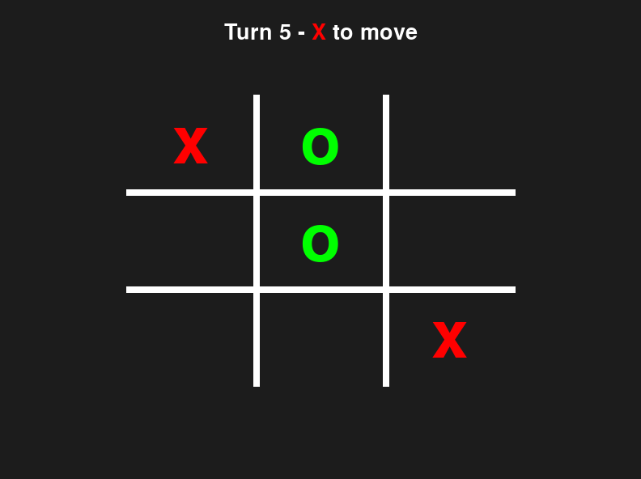
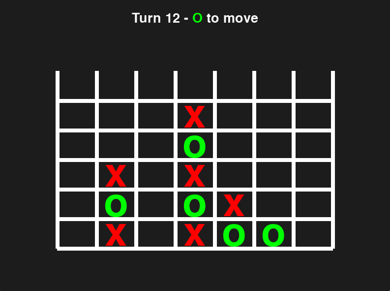

# Giotto AI

[](https://github.com/astral-sh/ruff) [](https://github.com/pre-commit/pre-commit) 

Giotto and Giottino are AlphaZero-inspired agents for the games of TicTacToe and Connect4 that can achieve near-perfect play.
This repository contains the env implementation of the two player grid based games TicTacToe and Connect4, together with the web and Pygame implementation of the games and a collection of agents that can play the game. It's possible to play against the agents or make them challenge eachother.

[PLAY IN BROWSER](https://nicolapesaresi.github.io/Giotto/)

 

## Games
Currently implemented games are:
- Tic Tac Toe (Tris)
- Connect 4

The code is structured to make it easy to expand the selection of games with others similarly structured, such as Connect 5 or Ultimate TicTacToe.

### Game theory

The game theory optimal result of TicTacToe is a draw, and the best starting move is one of the corners for the first player and the center for the second player. Giottino learned this strategy and always draws against perfect play (Minimax agent).

Connect4 is a forced win for the first player if he plays in the middle. Giotto can always win when starting against a perfect player (BitBully agent), and loses in 38 moves (optimal is 41) when playing second.

## Agents
Currently implemented agents are:
- Human
- Random
- Minimax
- Monte Carlo Tree Search
- Giottino (TicTacToe alphazero style agent)
- Giotto (Connect4 alphazero style agent)

Defaults parameters for the agents, such as number of MCTS simulations, can be found at `giotto/games/settings/agent_settings.py`.  
Minimax supports both games, but is by default turned off for Connect4 as it is too slow.

## Structure
The repository is structured as follows:
- In the `giotto/envs` folder you can find the game environments. These define the games rules and logic.
- In the `giotto/games` folder are the pygame interfaces for the game environments.
- In the `giotto/scripts` are utilities to play in text mode or in Pygame, as well as simulate many games between agents or evaluate their play from a fixed/random starting move.
- The `web` folder contains the JS code to run the game and the agents in browser.

## Installation
The repository is setup us as a poetry project and by default requires Python 3.10 or later.
To install the repository you can follow these steps:

First, install `poetry` if you haven't already, as indicated by the instructions on the [Poetry installation page](https://python-poetry.org/docs/).
Then, clone the repository to your local machine using the following command:
```
git clone https://github.com/nicolapesaresi/Giotto
cd Giotto
```
Create and activate a virtual environment:
```
# replace `myenv` with the name of your virtual environment
python3 -m venv myenv
source myenv/bin/activate
```
Or, if using `Conda`:
```
conda create -n myenv python=3.10
conda activate myenv
```
Use Poetry to install the project dependencies:
```
poetry install
```
Now you can launch the game on desktop with:
```
python giotto/scripts/run_pygame.py
```

## Development

The game is available in desktop mode with Pygame and in browser mode. Modifications to the game loop have to be replicated in both the game's pygame script and the web folder, to work both locally and in browser.

The browser version can be tested locally with `make runweb` and deployed to GitHub Pages with:
```
make publish
```

## Resources
- [Pygame documentation](https://www.pygame.org/docs/)
- [Minimax algorithm](https://en.wikipedia.org/wiki/Minimax)
- [Monte Carlo Tree Search](https://en.wikipedia.org/wiki/Monte_Carlo_tree_search)
- [AlphaZero paper](https://arxiv.org/abs/1712.01815)
- [Tic Tac Toe](https://en.wikipedia.org/wiki/Tic-tac-toe)
- [Connect 4](https://en.wikipedia.org/wiki/Connect_Four)
- [BitBully](https://github.com/MarkusThill/BitBully)
- [Kaggle implementation](https://www.kaggle.com/code/auxeno/alphazero-connect-4-rl/notebook)
- [Oracle AlphaZero posts](https://medium.com/oracledevs/lessons-from-implementing-alphazero-7e36e9054191)